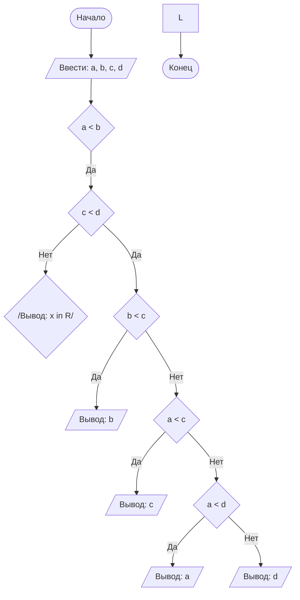

## Отчет по лабораторной работе № 1

#### № группы: `ПМ-2401`

#### Выполнил: `Поташев Фёдор Сергеевич`

#### Вариант: `22`

### Cодержание:

- [Постановка задачи](#1-постановка-задачи)
- [Входные и выходные данные](#2-входные-и-выходные-данные)
- [Выбор структуры данных](#3-выбор-структуры-данных)
- [Алгоритм](#4-алгоритм)
- [Программа](#5-программа)
- [Анализ правильности решения](#6-анализ-правильности-решения)

### 1. Постановка задачи

> На вход программы подается четыре различных целых числа. Вывести на
экран число, которое больше одного и меньше двух других чисел (то есть,
это число в отсортированной последовательности стояло бы вторым).

Нам необходимо рассмотреть все варианты расстановки этих четырех чисел (используем комбинаторику):

- У нас четыре числа, числа повторяться не могут и они все различны. Значит у нас 4!
вариантов, что равно 24


### 2. Входные и выходные данные

#### Данные на вход
На вход программа получает 4 различных целых числа. Так как числа целые, то они 
ограничены в диапазоне от -(2^31) до (2^31)-1.

|         | Тип         | min значение | max значение |
|---------|-------------|--------------|--------------|
| Число 1 | Целое число | -(2^31)      | (2^31)-1     |
| Число 2 | Целое число | -(2^31)      | (2^31)-1     |
| Число 3 | Целое число | -(2^31)      | (2^31)-1     |
| Число 4 | Целое число | -(2^31)      | (2^31)-1     |

#### Данные на выход
На выходе программа выдает одно из чисел введенных ранее, а значит у выходного числа
сохраняются все его изначальные свойства

|         | Тип         | min значение  | max значение  |
|---------|-------------|---------------|---------------|
| Число 1 | Целое число | Не ограничено | Не ограничено |

### 3. Выбор структуры данных

|         | Название переменной | Тип в Java |
|---------|---------------------|------------|
| Число 1 | `a`                 | `int`      |
| Число 2 | `b`                 | `int`      |

### 4. Алгоритм
1. **Ввод данных:**

    Программа считывает 4 различных числа, обозначенные как a, b, c и d.

2. **Сравнение чисел:**

   *Условно, число 1 больше числа 2:*
    1. В этом случае рассматриваем вариант, что число 3 больше числа 4, а после большее число
      из первой пары сравниваем с меньшим из второй. Если число больше
3. **Проверка знака для выбранного числа:**

- Если было выбрано число x (так как оно больше или равно y), проверяется, положительное оно или отрицательное. Если x положительное, оно выводится на экран. Если отрицательное, выводится его модуль (т.е. противоположное по знаку значение).
- Если было выбрано число y (поскольку оно больше x), выполняется аналогичная проверка. Если y положительное, оно выводится на экран. Если отрицательное, выводится его модуль.
4. **Вывод результата:**

    На экран выводится число, большее одного из введенных и меньше двух оставшихся.



### 5. Программа

Полный текст программы с комментариями на русском языке

Нужно вставить код прямо в отчет в блок:

```markdown
    ```java
        class Main{
            // Что-то далее
        }
    ``` 
```

Это будет выглядеть следующим образом:

```java
class Main{
    // Что-то далее
}
```

### 6. Анализ правильности решения

Привести тесты и анализ работы программы для этих тестов.
Очень неплохо было бы обосновать выбор тестов.

1. Тест на что-то

- Input:
    ```
    1
    1
    ```

- Output:
    ```
    2
    ```

2. Тест на что-то еще

- Input:
    ```
    1
    -1
    ```

- Output:
    ```
    0
    ```